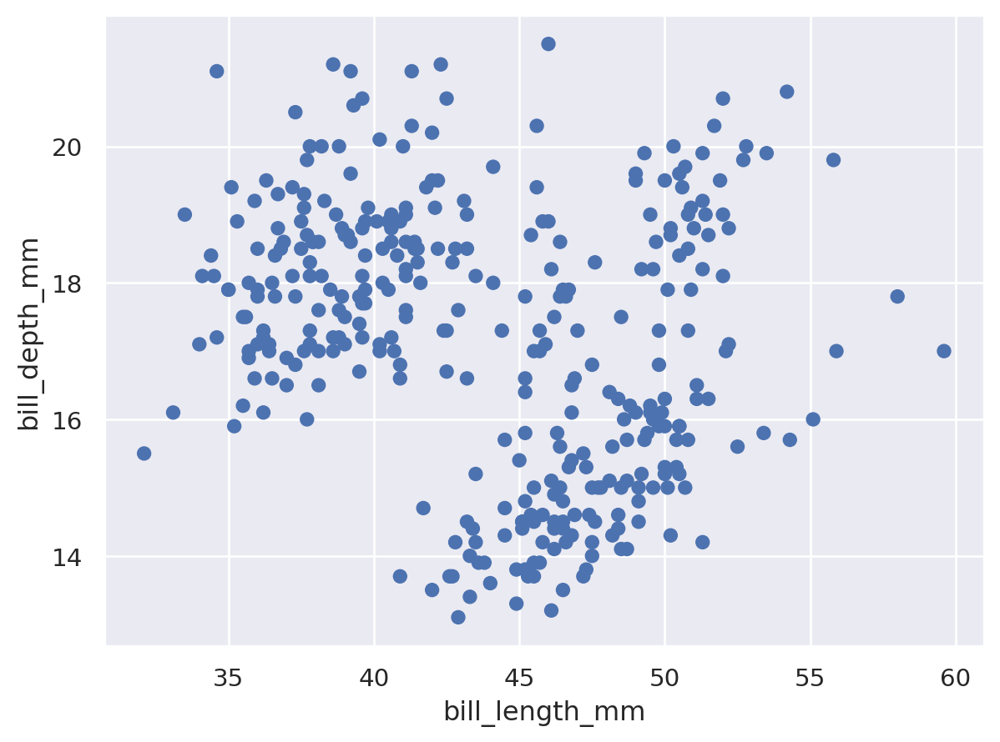
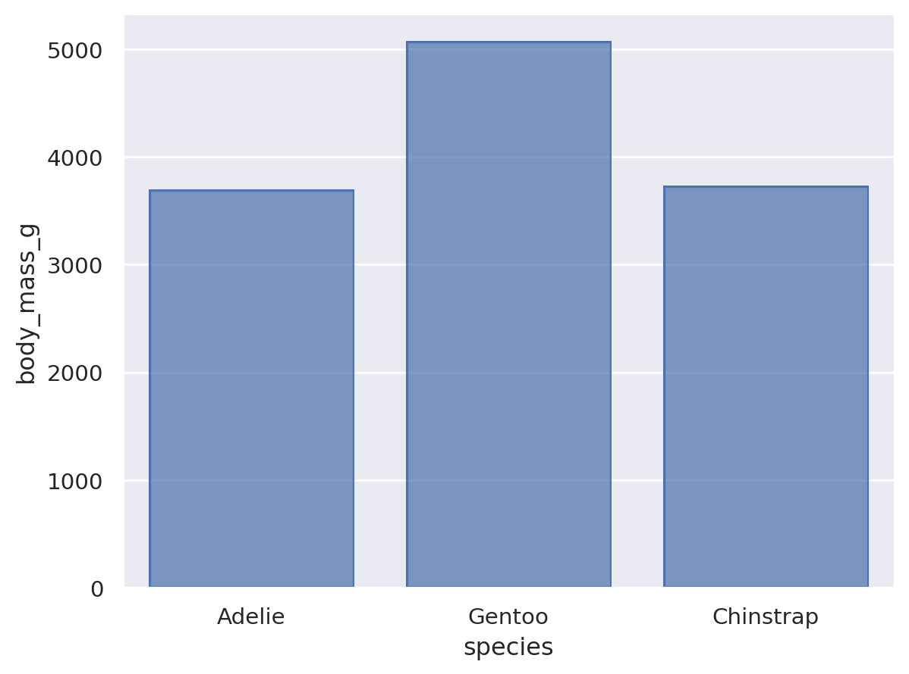
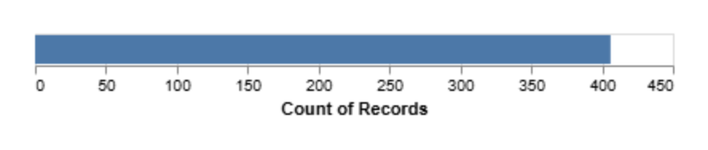

# Homework 1: Tool Setup

**William Glavin**  
CS 625, Fall 2026  
Due: Sunday, September 6, 2026

## Git, GitHub

### Q1 - URL of GitHub Repo

https://github.com/Wglav001/CS625

This is the URL of the Github repository I created for this exercise.

### Q2 - Pull Command

The pull command sends changes from the remote repository to the local repository. 

### Q3 - Local Commits

If a change has been committed locally but does not appear on Github, 
the change may not have been pushed to the remote repository. 

## Markdown

### Q1 - Bulleted List

- Running
- Traveling
- Coding

A bulleted list uses symbols to separate each item without suggesting a particular order. A numbered list uses numbers and is used when the order of the items matters.

### Q2 - Markdown Paragraph

This is an *italicized* word, while this text is **bold** and this text is ***bold and italicized***. Code can be displayed using `print("Hello World")`, and this is a link to [GitHub](https://github.com/Wglav001/CS625).

### Q3 - Animal Image

I saved an image of a cat in this repository. 

## Tableau

### Q1 - Region Other Than the South

## Google Colab

### Q1 - URL of Google Colab Notebook

I completed the overview of colaboratory features notebook, made some edits, 
and saved a copy to my drive : 

[Google Colab Notebook](https://colab.research.google.com/drive/1rh1Mhm6p0fckklUDTx3l5O9CBvuQSq9f?usp=sharing)

## Python/Seaborn

### Q1 - First Penguin Image

This scatterplot displays the relationship between penguin bill length and bill depth. Each point represents an observation from the penguin dataset, comparing the relationship and distribution of the two measurements visually.

### Q2 - Second Penguin Image

This bar chart compare the average body mass of the three penguin species in the dataset. Gentoo penguins have the highest body mass, and Adelie and Chinstrap penguins have lower body masses.

### Q3 - Outer Parenthesis

After removing the outer parentheses, the code produced an IndentationError. The parentheses allow the expression to continue across multiple lines, and without them, Python treats the first line as a complete statement and the indented .add() line throws an error.

From the sidebar chat in Colab : 
"The error IndentationError: unexpected indent is caused by the indentation of the .add method. To fix this, you can wrap the entire so.Plot and .add chain in parentheses, which allows the expression to span multiple lines correctly."

## Observable and Vega-Lite

### Q1 - markCircle to markSquare

When I changed it from mark circle to mark square, the plotted marks become squares instead of circles, 
and the underlying data and axes stay the same.

### Q2 - markCircle to markPoint

Similar to above, the data/axes stayed the same, but the plot points became hollow circles. 

### Q3 - Swap X and Y Axes on Scatterplot

In order to swap the axes, you just have to swap the fields assigned to x() and y() so that Miles_per_Gallon is used for x and Horsepower is used for y. (vl.y().fieldQ("Horsepower"), etc)

### Q4 - Remove fieldN(Origin)

Originally, Origin was mapped to he Y axis, so Vega lite separated the records into categories based on Origin. The line was commented out, so there was no longer a variable telling VL to create separate bars. The count() operation still counts the bars, so everything gets added together into one bar representing the total count of records. 

## References

- Tableau, "Get Started with Tableau Desktop," [https://help.tableau.com/current/guides/get-started-tutorial/en-us/get-started-tutorial-home.htm](https://help.tableau.com/current/guides/get-started-tutorial/en-us/get-started-tutorial-home.htm)

- Google Colab, "Overview of Colaboratory Features," [https://colab.research.google.com/notebooks/basic_features_overview.ipynb](https://colab.research.google.com/notebooks/basic_features_overview.ipynb)

- Seaborn, "The seaborn.objects interface," [https://seaborn.pydata.org/tutorial/objects_interface.html](https://seaborn.pydata.org/tutorial/objects_interface.html)

- Observable, "Charting with Vega-Lite," [https://observablehq.com/@observablehq/vega-lite](https://observablehq.com/@observablehq/vega-lite)

- ChatGPT, "Questions about Git, Markdown, Python, and Vega-Lite," [ChatGPT](https://chatgpt.com/s/t_6a8dae676774819184cb7944dc9e7825)