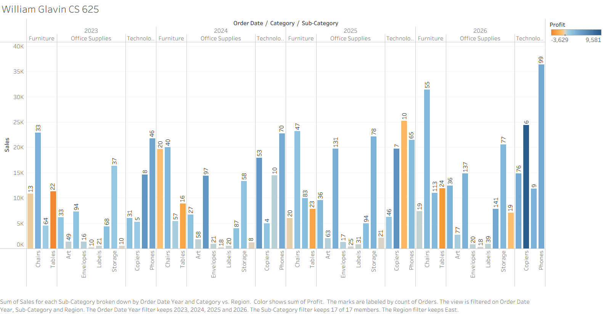

# Homework 1: Tool Setup

**Insert Your Name Here**  
CS 625, Fall 2026  
Due: Sunday, September 6, 2026

## Git, GitHub

### Q1 - URL of GitHub Repo

https://github.com/Wglav001/CS625

This is the URL of the Github repository I created for this exercise.

### Q2 - Pull Command

The pull command sends changes from the remote repository to the local repository. 

### Q3 - Local Commits

If a change has been committed locally but does not appear on Github, 
the change may not have been pushed to the remote repository. 

## Markdown

### Q1 - Bulleted List

- Running
- Traveling
- Coding

A bulleted list uses symbols to separate each item without suggesting a particular order. A numbered list uses numbers and is used when the order of the items matters.

### Q2 - Markdown Paragraph

This is an *italicized* word, while this text is **bold** and this text is ***bold and italicized***. Code can be displayed using `print("Hello World")`, and this is a link to [GitHub](https://github.com/Wglav001/CS625).

### Q3 - Animal Image

I saved an image of a cat in this repository. 

## Tableau

### Q1 - Region Other Than the South

## Google Colab

### Q1 - URL of Google Colab Notebook

Insert your answer and explanation here

## Python/Seaborn

### Q1 - First Penguin Image

Insert your answer and explanation here

### Q2 - Second Penguin Image

Insert your answer and explanation here

### Q3 - Outer Parenthesis

Insert your answer and explanation here

## Observable and Vega-Lite

### Q1 - markCircle to markSquare

Insert your answer and explanation here

### Q2 - markCircle to markPoint

Insert your answer and explanation here

### Q3 - Swap X and Y Axes on Scatterplot

Insert your answer and explanation here

### Q4 - Remove fieldN(Origin)

Insert your answer and explanation here

## References

*Eavery report must include a References section that lists the webpages and URLs that you consulted while completing the assignment. Replace the items below with the references you consulted - these are just examples.* ***Everyone will use some reference to complete these assignments (even I would). You will lose points on your assignment if you do not include the references you used.***

* Graph Network using Vega-Lite or Vega, <https://stackoverflow.com/questions/77096216/graph-network-using-vega-lite-or-vega>
* Calculating percentage change - Math for journalists, <https://observablehq.com/@nshiab/math-for-journalists>
* ChatGPT: "How can I add an axis label to my line chart in Seaborn?", <https://chatgpt.com/share/684c8e25-4944-8011-b265-ae9aefc07959>