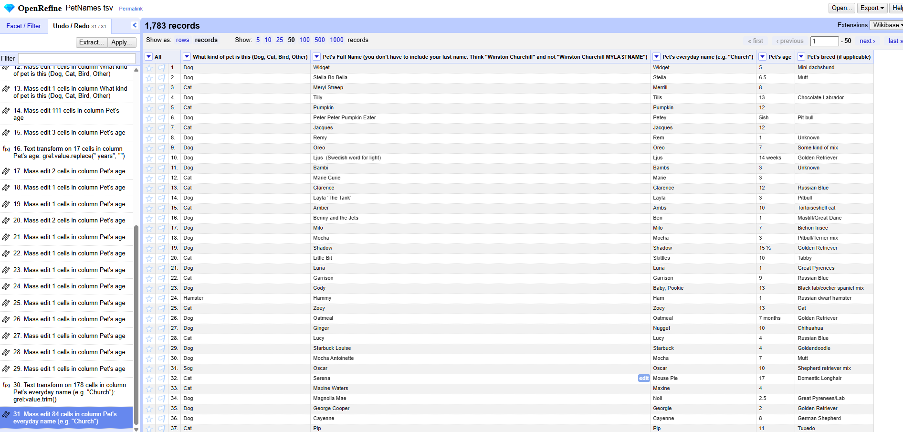
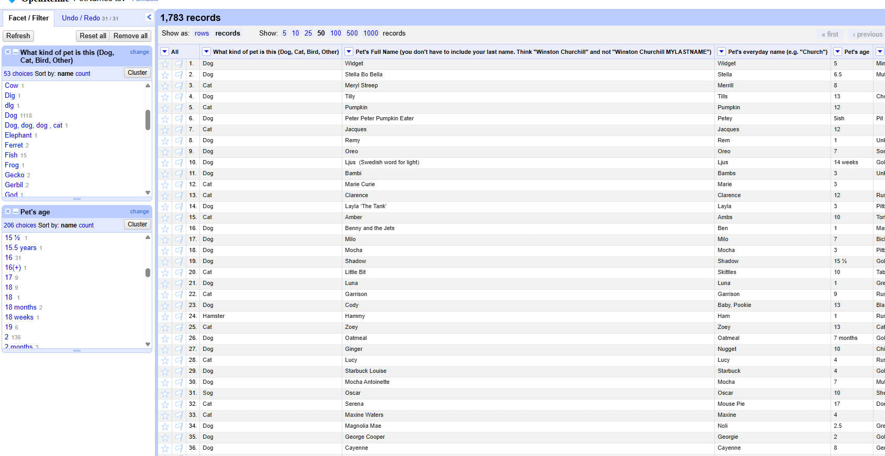

- I first removed leading and trailing whitespace from the pet-type column using the GREL expression value.trim(). This prevented otherwise identical pet types from being treated as separate values.

- I used OpenRefine's clustering feature to identify values that likely represented the same pet type despite differences in capitalization, spelling, or formatting. I reviewed the suggested clusters and merged only values that clearly represented the same type of pet.

- I filtered the dataset to records whose cleaned pet type was "Dog" and created a text facet on the breed column. I removed leading and trailing whitespace using the GREL expression value.trim() and used OpenRefine's clustering feature to identify different representations of the same breed. I merged only values that clearly represented the same breed and manually corrected several remaining obvious inconsistencies. Blank and unknown breed values were not treated as distinct dog breeds.

- I filtered the dataset to cats and created a text facet on the age column. Since the analysis only required identifying the oldest cat, I standardized year-based age values by removing text such as "year" and "years" using GREL transformations such as value.replace(" years", ""). I left ages expressed in months or weeks unchanged because those values could not affect the oldest-cat result.

- I filtered the dataset to cats and created a text facet on the everyday-name column. I used the GREL expression value.trim() to remove leading and trailing whitespace so identical names would not be counted separately.

- I used a text facet on the everyday-name field and sorted the values by frequency. I removed whitespace with value.trim() and used clustering to identify capitalization and formatting variations of the same name. I reviewed suggested clusters manually and merged only values that clearly represented the same everyday name.

# How many kinds of pets are in your cleaned dataset?

I created a text facet on the cleaned pet-type column. The facet contained 50 unique choices, meaning there were 50 kinds of pets in the cleaned dataset. If I were to do a more thorough cleaning, I would guess that number would whittle down to about 40 or so. 

# How many breeds of dogs are in your cleaned dataset?

I filtered the cleaned pet-type facet to "Dog" and created a text facet on the breed column. After excluding blank and unknown breed values, the facet contained 445 unique dog breeds. Again with further cleaning I would guess this would be around 400 or so. People certainly get creative when describing their pets. 

# How many guinea pigs are in your cleaned dataset?

I created a text facet on the cleaned pet-type column and located the standardized "Guinea Pig" value. There were 10 records, meaning the cleaned dataset contained 10 guinea pigs.

# Who is the oldest cat in your cleaned dataset? Give the cat's name, breed, and age. If there's a tie, list all oldest cats.

The oldest cat was Bruce Springsteen, everyday name Bruce, age 24, breed just listed as "Cat". I hope that Bruce is still going strong. 

# What is the most popular everyday name for a cat in your cleaned dataset? If there's a tie, list all top names and number of occurrences.

I filtered the dataset to cats and created a text facet on the cleaned everyday-name column. I sorted the facet by count to rank names by frequency. Kitty was the most common everyday cat name, appearing 7 times.