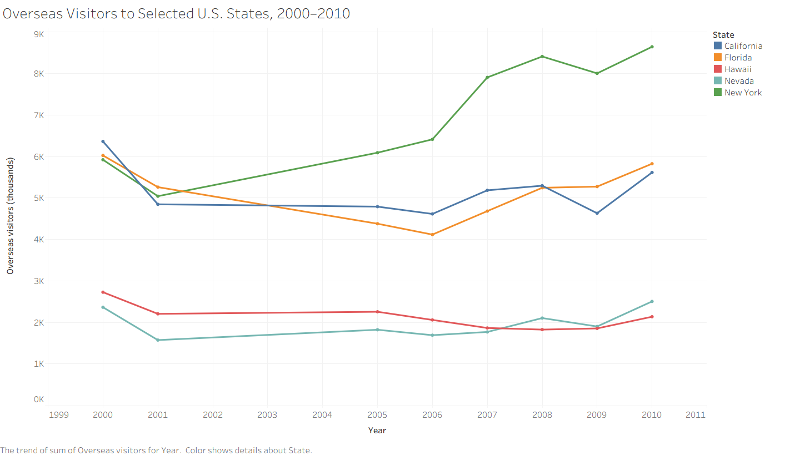
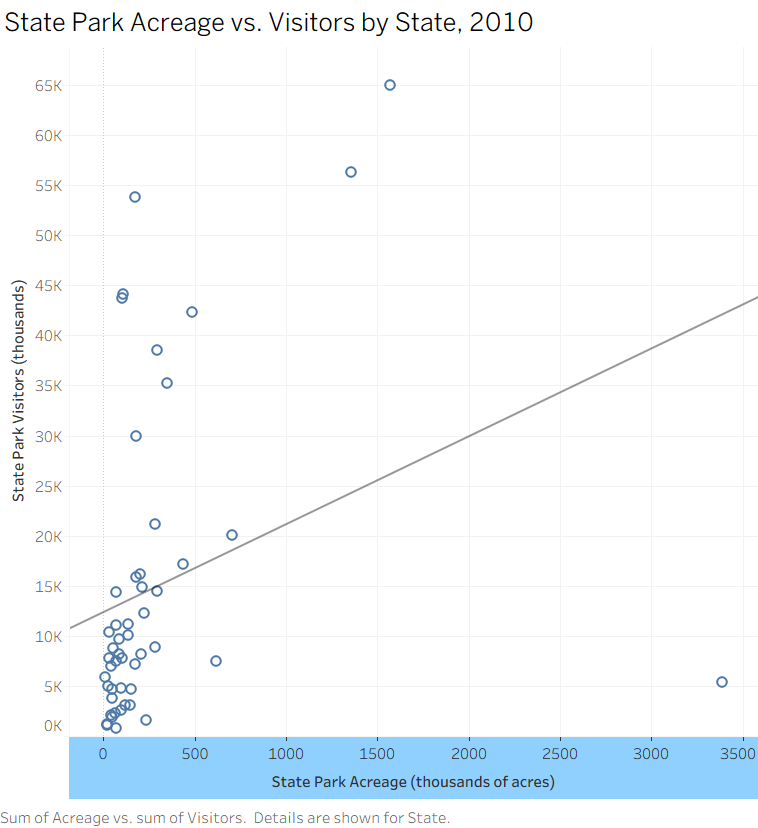
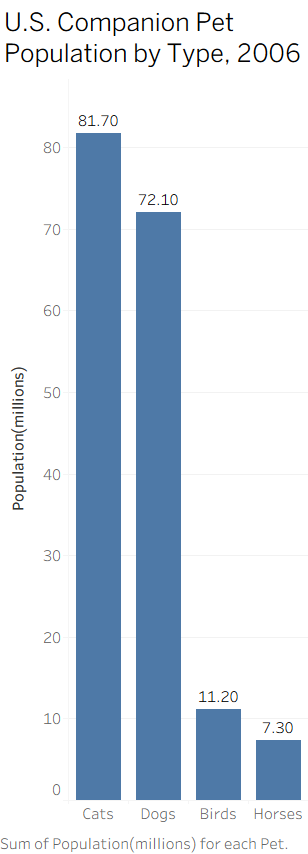
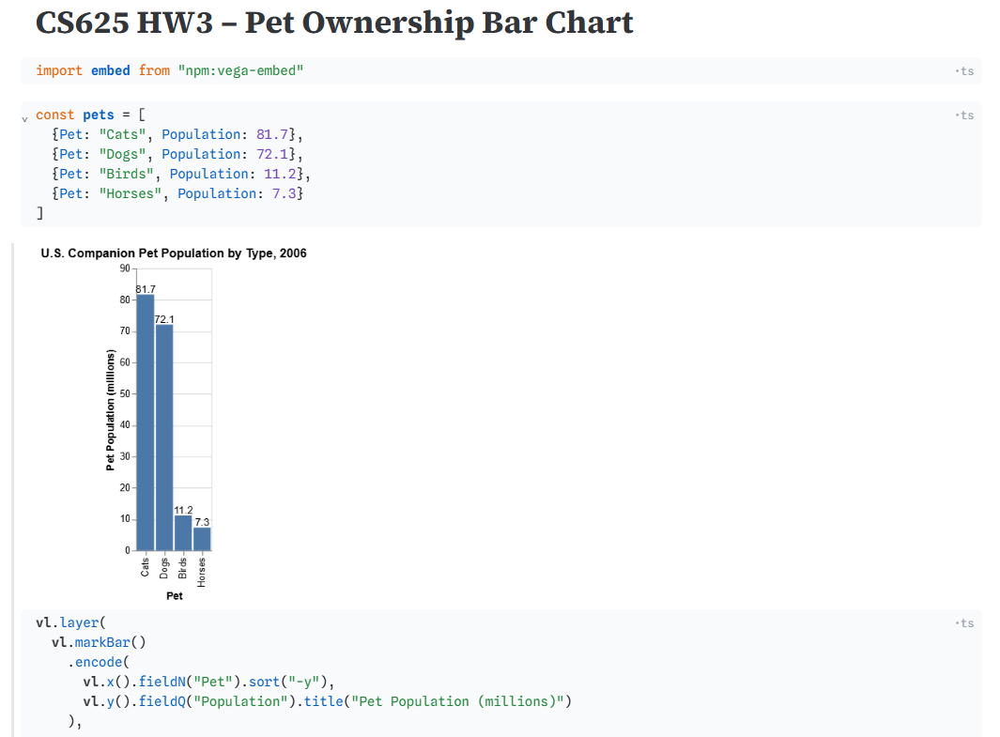
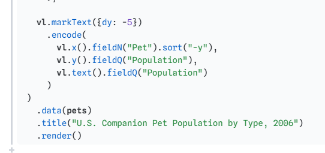

# William Glavin
# CS 625 - Homework 3
# September 2026

# HW3 - Visualization Idioms

## Data

The data used for these visualizations comes from the U.S. Census Bureau's *Statistical Abstract of the United States: 2012*. I used three tables from Section 26: Arts, Recreation, and Travel, to create the three different types of charts.

For the multiple-line chart, I used Table 1261, *Top States and Cities Visited by Overseas Travelers: 2000 to 2010*. I selected five state areas that had complete data for the reported years: New York, Florida, California, Nevada, and the Hawaiian Islands. I copied the values I needed into a smaller spreadsheet and changed the data into long format with columns for state, year, and overseas visitors. Using five states kept the chart readable while still giving enough lines to compare changes over time.

For the scatterplot, I used Table 1253 *State Park and Recreation Areas by State: 2010*. I kept the state, acreage, and visitor columns needed for the chart and removed the United States aggregate row. This left each state as its own observation in the scatterplot.

For the bar chart, I used Table 1241 *Household Pet Ownership: 2006*. I selected the total companion pet population values for dogs, cats, birds, and horses and created a smaller spreadsheet containing the pet type and population in millions. The same four values were entered directly into Observable for the Vega-Lite recreation.

## Chart 1: Overseas Visitors to Selected U.S. States

This multiple-line chart shows the number of overseas visitors to five selected U.S. state areas from 2000 through 2010. The data comes from Table 1261, *Top States and Cities Visited by Overseas Travelers: 2000 to 2010*. Five state areas with complete values for the reported years were selected to keep the visualization readable while still allowing trends between states to be compared.

A multiple-line chart is appropriate because the visualization compares changes in a quantitative variable over time across multiple categorical values. Each line represents one state area, allowing differences in both overall visitor levels and changes over time to be seen.

| Component | Description |
| --- | --- |
| Idiom | Multiple-line chart |
| Mark | Lines and point markers |
| Data | State (categorical), Year (temporal), Overseas visitors (quantitative) |
| X-axis | Year |
| Y-axis | Overseas visitors (thousands) |
| Color | State |

The chart was customized with descriptive axis labels, a title, separate colors for each state, and point markers for the individual observations. The year field was treated as continuous so that the spacing reflects the years represented in the source data.

[Tableau workbook](HW3-Tableau.twbx)

---

## Chart 2: State Park Acreage vs. Visitors

This scatterplot uses data from Table 1253, *State Park and Recreation Areas by State: 2010*. It compares state park acreage with the number of state park visitors for each state. The United States aggregate was excluded so that each mark represents an individual state.

A scatterplot is appropriate because both acreage and number of visitors are quantitative variables. Plotting them against each other makes it possible to examine whether states with more state park acreage also tend to have more visitors and to identify states that differ substantially from the general distribution.

| Component | Description |
| --- | --- |
| Idiom | Scatterplot |
| Mark | Point/circle |
| Data | State (categorical), Acreage (quantitative), Visitors (quantitative) |
| X-axis | State park acreage (thousands of acres) |
| Y-axis | State park visitors (thousands) |
| Detail | State |

The visualization was customized with descriptive axis titles and state information in the tooltip. A linear trend line was added to help show the overall relationship between acreage and visitation. Individual states were kept as separate observations, including outliers such as Alaska rather than removing them from the data.

[Tableau workbook](HW3-Scatterplot.twbx)

---

## Chart 3: U.S. Companion Pet Population by Type

This bar chart uses data from Table 1241, *Household Pet Ownership: 2006*. The visualization uses the reported total companion pet populations for dogs, cats, birds, and horses, measured in millions.

A bar chart is appropriate because the goal is to compare one quantitative value across a small number of categorical groups. The common baseline makes differences in pet populations easy to compare.

| Component | Description |
| --- | --- |
| Idiom | Simple bar chart |
| Mark | Bar |
| Data | Pet type (categorical), Population (quantitative) |
| X-axis | Pet type |
| Y-axis | Pet population (millions) |
| Order | Descending population |

The bars were sorted from highest to lowest population. Data labels were added to show the exact population represented by each bar, and the title and axis labels were edited to clearly describe the data and its units.

[Tableau workbook](HW3-Bar.twbx)

---

## Chart 4: U.S. Companion Pet Population by Type - Vega-Lite Recreation

The companion pet population bar chart was recreated using Observable. The same data and basic visual encodings used in the Tableau version were retained so that the results produced by the two visualization tools could be directly compared.

A bar chart is appropriate for this data because it compares a quantitative value, population, across a small number of categorical pet types. Using the same idiom also makes it possible to directly compare the Observable  recreation with the original Tableau chart.

| Component | Description |
| --- | --- |
| Idiom | Simple bar chart |
| Mark | Bar |
| Data | Pet type (categorical), Population (quantitative) |
| X-axis | Pet type |
| Y-axis | Pet population (millions) |
| Order | Descending population |

The Vega-Lite visualization uses the same four pet categories and population values as the Tableau visualization. The data was defined directly in the Observable notebook because only four observations were required for the chart.

[View the Vega-Lite notebook in Observable](https://observablehq.com/d/73849661474ced08)
---

## Discussion

Tableau and Vega-Lite provide different approaches to creating the same visualization. In Tableau, the bar chart could be created quickly by dragging the categorical and quantitative fields onto the appropriate shelves and then changing properties such as sorting, labels, and titles through the interface. This made it easy to experiment with the visualization and immediately see the results of changes.

Vega-Lite uses a more explicit, code-based approach. The data, mark type, and visual encodings are defined in the visualization specification. Creating the bar chart required specifying that pet type was a nominal field on the x-axis and population was a quantitative field on the y-axis. Although this required more code than the Tableau version, the relationship between the data and its visual encoding was more directly represented in the code.

Both tools produced similar bar charts from the same underlying data. Tableau provided a convenient interactive interface for constructing and modifying the visualization, while Vega-Lite provided a concise and reproducible specification describing how the visualization should be constructed. Overall, I found Tableau easier to use and customize for this visualization.

---

## References

U.S. Census Bureau. *Statistical Abstract of the United States: 2012*.  
https://www.census.gov/library/publications/2011/compendia/statab/131ed.html

U.S. Census Bureau. Table 1261, *Top States and Cities Visited by Overseas Travelers: 2000 to 2010*.  
https://www2.census.gov/library/publications/2011/compendia/statab/131ed/tables/12s1261.xls

U.S. Census Bureau. Table 1253, *State Park and Recreation Areas by State: 2010*.  
https://www2.census.gov/library/publications/2011/compendia/statab/131ed/tables/12s1253.xls

U.S. Census Bureau. Table 1241, *Household Pet Ownership: 2006*.  
https://www2.census.gov/library/publications/2011/compendia/statab/131ed/tables/12s1241.xls

Vega-Lite. *Vega-Lite Documentation*.  
https://vega.github.io/vega-lite/

Observable. *Observable Documentation*.  
https://observablehq.com/documentation/