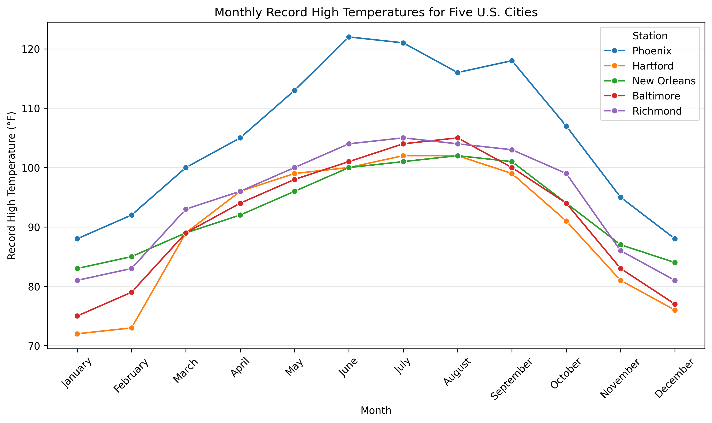
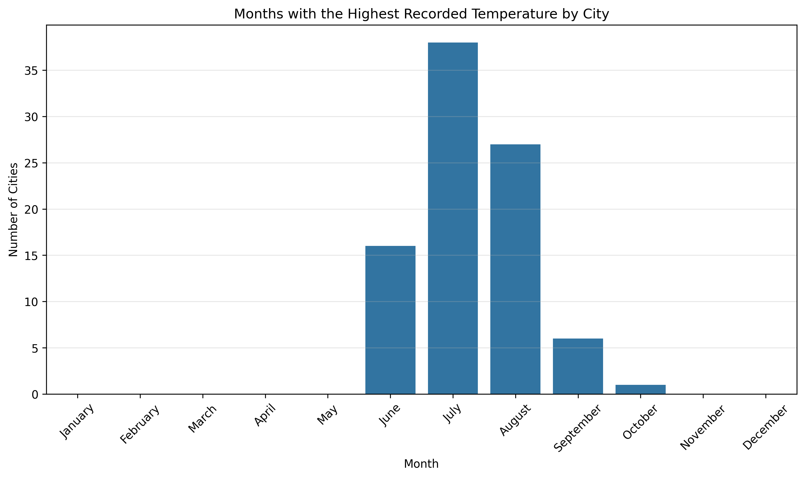

# CS625-HW4

**William Glavin**
**Date:** September 2026

## Dataset

For this assignment I used Table 379, *Highest Temperature of Record - Selected Cities*, from Section 6 - Geography and Environment of the 2010 Statistical Abstract of the United States. The dataset contains record high temperatures for selected U.S. cities for each month of the year.

The data was cleaned before creating the visualizations. Columns that were not necessary for the questions, such as length of record and annual temperature, were removed. The charts were created locally in Python using pandas, Seaborn, and Matplotlib.

## Question 1 - Record High Temperatures for Five Cities

**Question:** Choose 5 cities and compare their record highs in each month. You may pick the 5 cities however you wish, but you must discuss how you chose the cities.

[Python/Seaborn code](https://github.com/Wglav001/CS625/blob/main/HW4/HW4.py)

### City Selection

I selected Phoenix, Hartford, New Orleans, Baltimore, and Richmond for a combination of personal interest and differences in climate. Phoenix, Baltimore, and Hartford were selected because I have upcoming marathons in those cities (Feb 27, Oct 26, Fall 27 respectively). Phoenix was also of particular interest because of its reputation for extreme heat. I chose New Orleans because I expected its record high temperatures to be comparable to Phoenix, although its summer weather is strongly associated with high humidity. Finally, I selected Richmond because it is where I currently live and provides a good point of comparison for the other cities.

### Idiom, Mark, Data, and Encode

| Component | Description |
| --- | --- |
| Idiom | Multiple-line chart |
| Mark | Lines and points |
| Data | Monthly record high temperatures for five selected U.S. cities |
| Encode | Month is encoded by horizontal position, record high temperature is encoded by vertical position, and city is encoded by color |

### Idiom Choice

A multiple-line chart is appropriate for this question because the task is to compare how record high temperatures vary across an ordered sequence of months for multiple cities. Position along the x-axis represents the months from January through December, while position on the y-axis represents temperature in degrees Fahrenheit. Using a separate line for each city makes it possible to compare both the overall seasonal pattern and differences between the five cities.

### Insights

The chart shows that Phoenix has substantially higher record temperatures than the other four cities during much of the year. Its record temperatures increase rapidly during the spring and reach their highest level in June at 122°F. The other four cities are grouped much more closely together and generally reach their highest temperatures during July or August.

New Orleans was particularly interesting because I initially expected its record high temperatures to be closer to those of Phoenix. Instead, its record highs are much more similar to Baltimore, Hartford, and Richmond. This suggests that the extreme summer conditions associated with New Orleans are not explained by record air temperature alone, with humidity likely playing an important role.

### Design Decisions and Customizations

The months were placed in chronological order on the x-axis so that the seasonal pattern could be followed naturally. Each city was represented by a separate colored line, and point marks were added at each month to make the individual observations easier to identify. The y-axis was labeled with degrees Fahrenheit to clearly indicate the unit of measurement.

A horizontal grid was added to make comparisons of temperatures across cities easier without adding unnecessary vertical grid lines. The chart was created at a 10-by-6-inch size and saved at 300 DPI so that it would remain readable when included in the report.

## Question 2 - Month Most Often Containing the Highest High

**Question:** Using the data from all of the cities, which month most often has the highest high?

[Python/Seaborn code for Question 2](https://github.com/Wglav001/CS625/blob/main/HW4/Chart2.py)

### Idiom, Mark, Data, and Encode

| Component | Description |
| --- | --- |
| Idiom | Bar chart |
| Mark | Bars |
| Data | Count of cities for which each month contains the city's highest recorded temperature |
| Encode | Month is encoded by horizontal position and the number of cities is encoded by bar height/vertical position |

### Idiom Choice

A bar chart is appropriate for this question because the task is to compare the number of times each month contains a city's highest recorded temperature. The months act as discrete categories, while the number of cities is a quantitative value. Bar length provide a straightforward way to compare these counts and makes the month with the largest count immediately visible.

### Insights

July most often contains the highest recorded temperature for a city in the dataset. July was tied for or contained the highest high for 38 cities/stations, followed by August with 27 and June with 16. September accounted for 6 occurrences and October for 1. None of the cities had their highest recorded temperature in January through May or November through December.

The results show that the highest recorded temperatures are heavily concentrated in the summer months, particularly July and August. The difference between July and the other months is especially visible in the bar chart.

### Design Decisions and Customizations

All twelve months were retained in the chart, including months with a count of zero. This makes it possible to see that none of the cities in the dataset reached their highest recorded temperature during those months rather than simply omitting them from the visualization.

Ties were also considered when processing the data. If multiple months shared the same highest recorded temperature for a city, each tied month was counted. This avoids assigning the city to only one month when the data shows that its record high occurred in multiple months.

The months were displayed chronologically, and a horizontal grid was included to make the bar heights easier to compare. The y-axis represents the number of cities rather than temperature because this visualization summarizes the frequency with which each month contains a city's highest high.

## Further Questions

The visualizations raise additional questions about how geography and climate affect record temperatures. One question is whether cities in particular geographic regions tend to reach their annual record highs during different parts of the summer. For example, cities in the Southwest may reach their highest temperatures earlier than cities in other regions. I would hypothesize that geographic location and regional climate patterns would produce differences in when record highs occur.

Another question prompted by the first visualization is how record high temperature relates to humidity. New Orleans did not have record temperatures comparable to Phoenix even though it is known for extreme summer conditions. A dataset containing humidity or heat index measurements could help determine how temperature and humidity combine to produce different types of extreme heat.

Table 380, *Lowest Temperature of Record - Selected Cities*, could also be combined with this dataset to examine the overall range between record high and record low temperatures for each city.

## References

- U.S. Census Bureau. *Statistical Abstract of the United States: 2010*, Section 6: Geography and Environment, Table 379, "Highest Temperature of Record - Selected Cities."
- U.S. Census Bureau. *Statistical Abstract of the United States: 2010*, Section 6: Geography and Environment.
- pandas documentation. `pandas.read_csv()`, `DataFrame.melt()`, and `Categorical`.
- Seaborn documentation. `seaborn.lineplot()` and `seaborn.barplot()`.
- Matplotlib documentation. Plot formatting, labels, grid lines, and figure saving.